# ERD Specification

**Document Version:** 1.0  
**Date:** 2026-06-07  
**Application:** Majhi Dairy

## 1. High-Level ERD

The Majhi Dairy domain model is centered on the `farms` tenant. Users authenticate through Supabase Auth, join farms through `farm_members`, and then create records against farm-owned entities.

```mermaid
erDiagram
  USERS ||--o{ FARMS : "farms.owner_user_id"
  USERS ||--o{ FARM_MEMBERS : "farm_members.user_id"
  FARMS ||--o{ FARM_MEMBERS : "farm_members.farm_id"
  FARMS ||--o{ COWS : "cows.farm_id"
  FARMS ||--o{ CALVES : "calves.farm_id"
  COWS ||--o{ CALVES : "calves.mother_cow_id"
  FARMS ||--o{ MILK_RECORDS : "milk_records.farm_id"
  COWS ||--o{ MILK_RECORDS : "milk_records.cow_id"
  FARMS ||--o{ SETTLEMENTS : "settlements.farm_id"
  SETTLEMENTS ||--o{ SETTLEMENT_ITEMS : "settlement_items.settlement_id"
  MILK_RECORDS ||--o{ SETTLEMENT_ITEMS : "settlement_items.matched_milk_record_id"
  FARMS ||--o{ EXPENSES : "expenses.farm_id"
  SETTLEMENTS ||--o{ EXPENSES : "expenses.settlement_id"
  COWS ||--o{ BREEDING_RECORDS : "breeding_records.cow_id"
  COWS ||--o{ CALVING_RECORDS : "calving_records.cow_id"
  CALVING_RECORDS ||--|| CALVES : "calving_records.calf_id"
  FARMS ||--o{ REMINDERS : "reminders.farm_id"
  COWS ||--o{ REMINDERS : "reminders.cow_id"
  CALVES ||--o{ REMINDERS : "reminders.calf_id"
  USERS ||--o{ GOALS : "goals.user_id"
  FARMS ||--o{ GOALS : "goals.farm_id"
  NOTIFICATIONS ||--o{ NOTIFICATION_LOGS : "notification_logs.notification_id"
  USERS ||--o{ NOTIFICATION_LOGS : "notification_logs.user_id"
  AI_CHATS ||--o{ AI_MESSAGES : "ai_messages.chat_id"
  OCR_UPLOADS ||--o{ OCR_EXTRACTIONS : "ocr_extractions.upload_id"
  SUPPORT_TICKETS ||--o{ SUPPORT_MESSAGES : "support_messages.ticket_id"
  FARMS ||--o{ BACKUPS : "backups.farm_id"
  FARMS ||--o{ AUDIT_LOGS : "audit_logs.farm_id"
  FARMS ||--o{ SETTINGS : "settings.farm_id"
  USERS ||--o{ SETTINGS : "settings.user_id"
  USERS {
    UUID id
    TEXT email
    TEXT phone
    TEXT full_name
    TEXT default_language
    TEXT role
    TEXT status
    TEXT profile_photo_path
  }
  FARMS {
    UUID id
    TEXT farm_code
    TEXT name
    UUID owner_user_id
    TEXT village
    TEXT taluka
    TEXT district
    TEXT state
  }
  FARM_MEMBERS {
    UUID id
    UUID farm_id
    UUID user_id
    TEXT role
    TEXT status
    JSONB permissions
    UUID invited_by
    TIMESTAMPTZ joined_at
  }
  COWS {
    UUID id
    UUID farm_id
    TEXT tag_number
    TEXT name
    TEXT breed
    DATE dob
    DATE purchase_date
    TEXT status
  }
  CALVES {
    UUID id
    UUID farm_id
    UUID mother_cow_id
    UUID converted_cow_id
    TEXT name
    TEXT gender
    DATE birth_date
    TEXT status
  }
  MILK_RECORDS {
    UUID id
    UUID farm_id
    UUID cow_id
    DATE record_date
    NUMERIC10_2 morning_liters
    NUMERIC10_2 evening_liters
    NUMERIC10_2 total_liters
    NUMERIC5_2 fat_percent
  }
  FEED_RECORDS {
    UUID id
    UUID farm_id
    UUID cow_id
    UUID calf_id
    DATE record_date
    TEXT feed_type
    NUMERIC12_3 quantity
    TEXT unit
  }
  HEALTH_RECORDS {
    UUID id
    UUID farm_id
    UUID cow_id
    UUID calf_id
    DATE record_date
    TEXT health_type
    TEXT diagnosis
    TEXT symptoms
  }
  VACCINATIONS {
    UUID id
    UUID farm_id
    UUID cow_id
    UUID calf_id
    TEXT vaccine_name
    TEXT vaccine_type
    DATE administered_date
    DATE due_date
  }
  BREEDING_RECORDS {
    UUID id
    UUID farm_id
    UUID cow_id
    DATE breeding_date
    TEXT method
    TEXT semen_or_bull
    TEXT technician_name
    TEXT status
  }
  CALVING_RECORDS {
    UUID id
    UUID farm_id
    UUID cow_id
    UUID calf_id
    UUID breeding_record_id
    DATE calving_date
    TEXT calving_type
    TEXT outcome
  }
  REMINDERS {
    UUID id
    UUID farm_id
    UUID cow_id
    UUID calf_id
    TEXT related_table
    UUID related_record_id
    TEXT type
    TEXT title
  }
  EXPENSES {
    UUID id
    UUID farm_id
    DATE expense_date
    TEXT accounting_month
    TEXT category
    TEXT subcategory
    NUMERIC12_2 amount
    TEXT payment_method
  }
  SETTLEMENTS {
    UUID id
    UUID farm_id
    TEXT dairy_name
    TEXT member_code
    DATE period_start
    DATE period_end
    DATE settlement_date
    NUMERIC12_2 morning_total_liters
  }
  SETTLEMENT_ITEMS {
    UUID id
    UUID settlement_id
    UUID farm_id
    DATE record_date
    TEXT session
    NUMERIC10_2 liters
    NUMERIC5_2 fat_percent
    NUMERIC5_2 snf_percent
  }
  REPORTS {
    UUID id
    UUID farm_id
    UUID user_id
    TEXT report_type
    TEXT format
    DATE date_start
    DATE date_end
    JSONB filters
  }
  GOALS {
    UUID id
    UUID farm_id
    UUID user_id
    TEXT goal_type
    NUMERIC14_2 target_value
    TEXT unit
    DATE period_start
    DATE period_end
  }
  NOTIFICATIONS {
    UUID id
    UUID farm_id
    TEXT title
    TEXT message
    TEXT type
    TEXT priority
    TEXT action_text
    TEXT action_url
  }
  NOTIFICATION_LOGS {
    UUID id
    UUID notification_id
    UUID farm_id
    UUID user_id
    TEXT channel
    TEXT delivery_status
    TIMESTAMPTZ delivered_at
    TIMESTAMPTZ read_at
  }
  AI_CHATS {
    UUID id
    UUID farm_id
    UUID user_id
    TEXT title
    TEXT language
    TEXT status
    JSONB metadata
    TIMESTAMPTZ created_at
  }
  AI_MESSAGES {
    UUID id
    UUID chat_id
    UUID farm_id
    UUID user_id
    TEXT role
    TEXT content
    JSONB tool_calls
    JSONB data_sources
  }
  OCR_UPLOADS {
    UUID id
    UUID farm_id
    UUID user_id
    TEXT slip_type
    TEXT image_path
    TEXT original_filename
    TEXT mime_type
    BIGINT file_size_bytes
  }
  OCR_EXTRACTIONS {
    UUID id
    UUID upload_id
    UUID farm_id
    TEXT provider
    TEXT raw_text
    JSONB extracted_json
    NUMERIC5_2 confidence
    JSONB warnings
  }
  ACHIEVEMENTS {
    UUID id
    TEXT code
    TEXT title_mr
    TEXT title_en
    TEXT description_mr
    TEXT description_en
    TEXT category
    TEXT target_type
  }
  LEADERBOARD_ENTRIES {
    UUID id
    UUID farm_id
    TEXT leaderboard_type
    TEXT scope_type
    TEXT scope_value
    DATE period_start
    DATE period_end
    NUMERIC14_2 score
  }
  SUPPORT_TICKETS {
    UUID id
    UUID farm_id
    UUID user_id
    TEXT ticket_no
    TEXT subject
    TEXT category
    TEXT priority
    TEXT status
  }
  SUPPORT_MESSAGES {
    UUID id
    UUID ticket_id
    UUID farm_id
    UUID sender_user_id
    TEXT sender_role
    TEXT message
    JSONB attachments
    BOOLEAN internal_only
  }
  BACKUPS {
    UUID id
    UUID farm_id
    UUID user_id
    TEXT backup_type
    JSONB scope
    TEXT format
    TEXT file_path
    TEXT status
  }
  AUDIT_LOGS {
    UUID id
    UUID farm_id
    UUID user_id
    TEXT actor_role
    TEXT event_type
    TEXT entity_table
    UUID entity_id
    TEXT action
  }
  SETTINGS {
    UUID id
    UUID farm_id
    UUID user_id
    TEXT category
    TEXT setting_key
    JSONB setting_value
    UUID updated_by
    TIMESTAMPTZ created_at
  }
```

## 2. Logical ERD by Domain

### Identity and Tenant Domain
- `auth.users` to `users` is one-to-one.
- `users` to `farm_members` to `farms` implements many-to-many membership.
- `farms.owner_user_id` identifies the primary owner, but access is governed by `farm_members`.

### Animal Lifecycle Domain
- `farms` has many `cows` and `calves`.
- `calves.mother_cow_id` tracks lineage.
- `breeding_records` and `calving_records` maintain reproductive lifecycle.
- `reminders` link to cows/calves and source records.

### Milk and Accounting Domain
- `milk_records` stores manual, OCR and settlement-derived production records.
- `settlements` stores authoritative 15-day payment slip summaries.
- `settlement_items` stores daily/session table rows from settlements.
- `expenses` stores manual expenses and settlement-derived feed deductions.

### AI, OCR and Reporting Domain
- `ocr_uploads` has many `ocr_extractions`.
- `ai_chats` has many `ai_messages`.
- `reports` and `backups` store generated file metadata.
- `audit_logs` records significant changes and sensitive operations.

## 3. Relationship Matrix

| Parent | Child | Cardinality | Foreign Key | Delete / Update Rule |
| --- | --- | --- | --- | --- |
| users | farms | 1:N | farms.owner_user_id | RESTRICT until farm transfer |
| users | farm_members | 1:N | farm_members.user_id | CASCADE membership |
| farms | farm_members | 1:N | farm_members.farm_id | CASCADE tenant membership |
| farms | cows | 1:N | cows.farm_id | CASCADE on farm deletion |
| farms | calves | 1:N | calves.farm_id | CASCADE on farm deletion |
| cows | calves | 1:N | calves.mother_cow_id | SET NULL for lineage history |
| farms | milk_records | 1:N | milk_records.farm_id | CASCADE on farm deletion; soft delete normally |
| cows | milk_records | 1:N | milk_records.cow_id | SET NULL to retain farm record |
| farms | settlements | 1:N | settlements.farm_id | CASCADE on farm deletion |
| settlements | settlement_items | 1:N | settlement_items.settlement_id | CASCADE with settlement |
| milk_records | settlement_items | 1:N | settlement_items.matched_milk_record_id | SET NULL |
| farms | expenses | 1:N | expenses.farm_id | CASCADE on farm deletion |
| settlements | expenses | 1:N | expenses.settlement_id | SET NULL; soft-delete source preferred |
| cows | breeding_records | 1:N | breeding_records.cow_id | CASCADE animal lifecycle |
| cows | calving_records | 1:N | calving_records.cow_id | CASCADE animal lifecycle |
| calving_records | calves | 1:1 optional | calving_records.calf_id | SET NULL |
| farms | reminders | 1:N | reminders.farm_id | CASCADE tenant reminders |
| cows | reminders | 1:N | reminders.cow_id | SET NULL historical reminder |
| calves | reminders | 1:N | reminders.calf_id | SET NULL historical reminder |
| users | goals | 1:N | goals.user_id | CASCADE user goals |
| farms | goals | 1:N | goals.farm_id | CASCADE farm goals |
| notifications | notification_logs | 1:N | notification_logs.notification_id | CASCADE delivery logs |
| users | notification_logs | 1:N | notification_logs.user_id | CASCADE user logs |
| ai_chats | ai_messages | 1:N | ai_messages.chat_id | CASCADE chat messages |
| ocr_uploads | ocr_extractions | 1:N | ocr_extractions.upload_id | CASCADE extraction attempts |
| support_tickets | support_messages | 1:N | support_messages.ticket_id | CASCADE messages |
| farms | backups | 1:N | backups.farm_id | CASCADE backup metadata |
| farms | audit_logs | 1:N | audit_logs.farm_id | SET NULL after deletion/anonymization review |
| farms | settings | 1:N | settings.farm_id | CASCADE farm settings |
| users | settings | 1:N | settings.user_id | CASCADE user settings |

## 4. Physical ERD Considerations

- Use UUID primary keys with `gen_random_uuid()`.
- Use `TIMESTAMPTZ` for timestamps and `DATE` for farm business dates.
- Use `NUMERIC` for financial and milk measurements.
- Denormalize `farm_id` into child tables like `settlement_items`, `ai_messages`, and `notification_logs` for RLS and index performance.
- Use partial unique indexes for active records where soft delete applies.
- Use JSONB only for metadata and AI/OCR payloads; core business fields remain typed columns.
